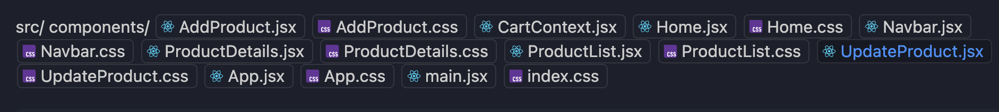
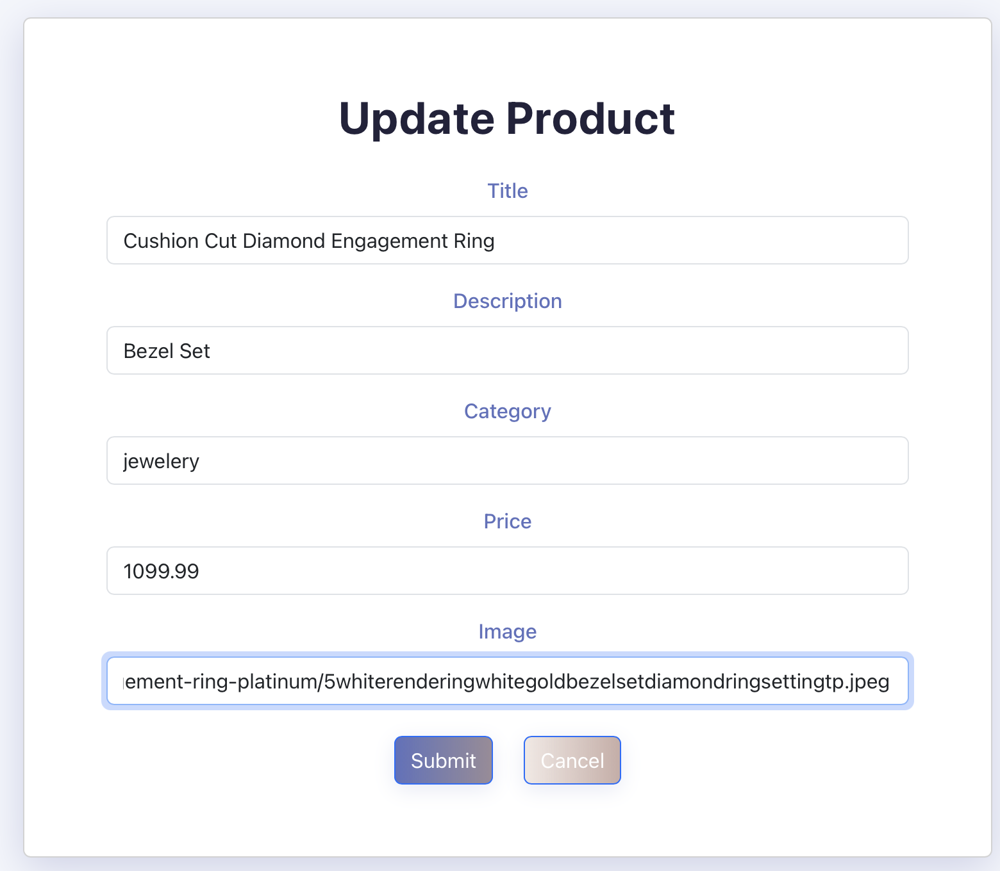
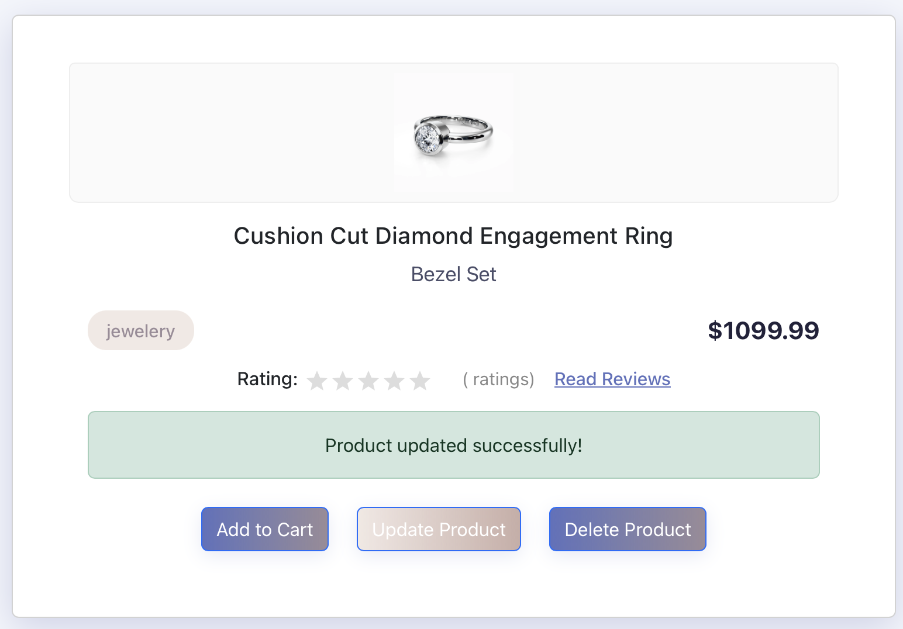

# FakeStore API React E-Commerce Project

## Author

[Jen Planque](https://github.com/jenplanque)

---

## Table of Contents

- [FakeStore API React E-Commerce Project](#fakestore-api-react-e-commerce-project)
  - [Author](#author)
  - [Table of Contents](#table-of-contents)
  - [Introduction](#introduction)
  - [Technologies Used](#technologies-used)
  - [Features](#features)
  - [Project Structure](#project-structure)
  - [Prerequisites](#prerequisites)
  - [Installation](#installation)
  - [Usage](#usage)
  - [Screenshots](#screenshots)

---

## Introduction

This project is a modern, responsive e-commerce front-end built with React, integrating the [FakeStoreAPI](https://fakestoreapi.com/) to provide dynamic product data. FakeStoreAPI is a free RESTful API that supplies fake e-commerce data, allowing developers to practice API integration without building a backend. This app demonstrates fetching, creating, updating, and deleting products, as well as managing a shopping cart - all with real API endpoints!

---

## Technologies Used

- [React 19](https://react.dev/)
- [React Router](https://reactrouter.com)
- [Axios](https://www.npmjs.com/package/axios)
- [Bootstrap (React-Bootstrap)](https://getbootstrap.com)
- [Vite](https://vitejs.dev/)
- [JavaScript (ES2020+)](https://www.javascript.com)
- [CSS](https://developer.mozilla.org/en-US/docs/Web/CSS/Reference)
- [FakeStoreAPI](fakestoreapi.com)

---

## Features

- **Dynamic Product Listing:** Fetches and displays products from FakeStoreAPI
- **Product Details:** View detailed information for each product
- **Add Product:** Create new products using a styled, responsive form
- **Update Product:** Edit existing products with a modern update form
- **Delete Product:** Remove products from the store
- **Cart Functionality:** Add products to a cart, with a live cart quantity badge in the navbar
- **Responsive Design:** Fully responsive and visually appealing on desktop and mobile
- **Modern UI:** Gradient buttons, animated home page, and polished layouts
- **Error Handling:** User-friendly error and success messages

---

## Project Structure



---

## Prerequisites

- [Node.js (v16+ recommended)](https://nodejs.org/en)
- npm or yarn

---

## Installation

1. **Clone the repository:**
   ```bash
   git clone https://github.com/jenplanque/fakestore_api.git
   cd fakestore_api
   ```

2. **Install dependencies:**

   ```bash
   npm install
   # or
   yarn install

   ```

3. **Start the development server:**
   ```bash
   npm install
   # or
   yarn install

   ```

4. **Open your browser and visit:**
   ```bash
   http://localhost:5173

   ```

---

## Usage

- **Home Page:** Welcomes users with a modern hero section and a call-to-action button
- **View Products:** Browse all products, each with a "View Details" button styled to match the app's theme
- **Product Details:** View product info (including new ratings data) add to cart, update, or delete
- **Add Product:** Use the form to add a new product to the database; success messages and formatting match the update form
- **Update Product:** Edit product details in a wide, responsive form
- **Cart:** Add items to the cart to see the cart quantity update in the navbar

---

## Screenshots

- **Home Page**  
  
  
- **Product List**  
  

- **Product Details**  
  

- **Update Product**  
  
  

---

[**About FakeStoreAPI**](https://fakestoreapi.com/)
```bash
FakeStoreAPI is a public, RESTful API for e-commerce data.

- No authentication needed
- Fake data (shared and modifiable by all users)
- Changes are not permanent
- CORS is allowed
- Great for learning API integration and error handling

Example Endpoints:
- GET /products — Fetch all products
- GET /products/:id — Fetch a single product
- POST /products — Add a product
- PUT /products/:id — Update a product
- DELETE /products/:id — Delete a product

For more info, visit https://fakestoreapi.com/

https://github.com/jenplanque/fakestore_api.git
